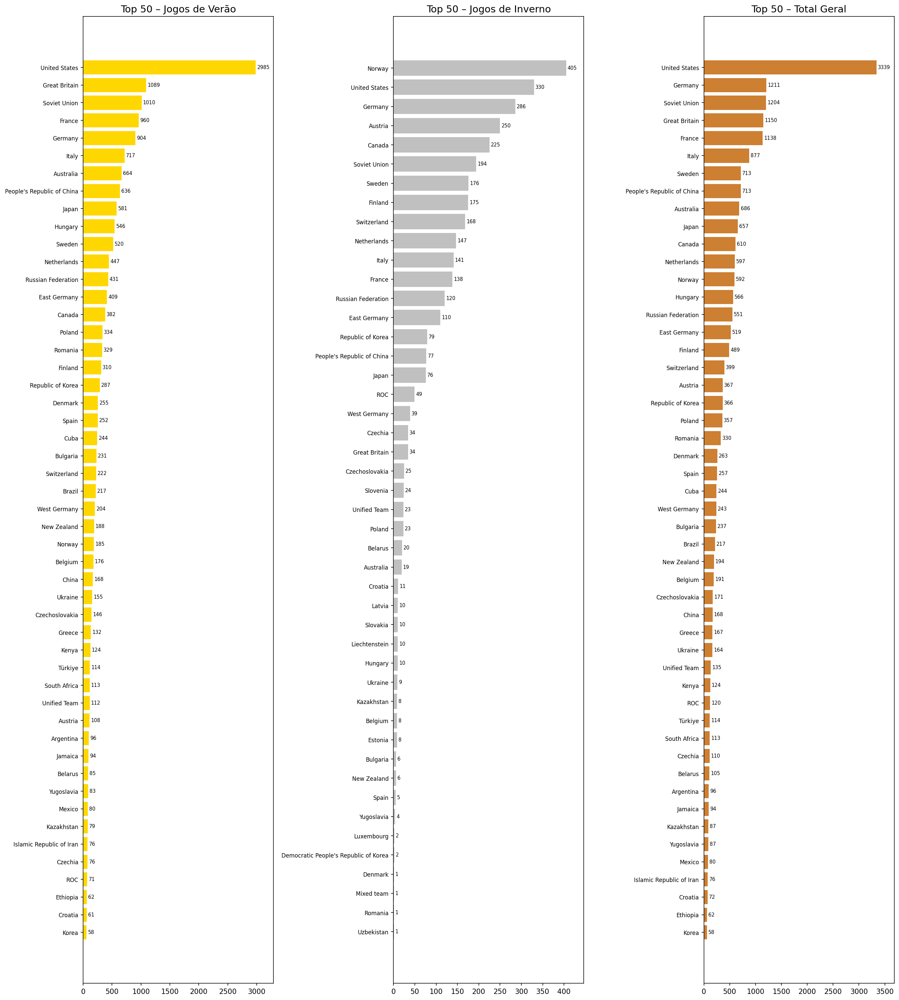

<h1 align="center">🏅 Olympic Medals Data Lake</h1>

<p align="center">
  
</p>

<p align="center">
  Data Lake para análise de medalhas olímpicas (1896–2024) com arquitetura medalhão, metadados JSON e visualizações.
</p>

<h1 align="center">📝 Descrição do Projeto</h1>

Este projeto implementa um **Data Lake local** para dados de medalhas olímpicas, integrando registros históricos (1896–2022) com os Jogos de Paris 2024. A arquitetura segue as camadas **raw → bronze → gold**, garantindo rastreabilidade, qualidade e reusabilidade dos dados. Cada dataset é acompanhado por um arquivo **JSON de metadados**, e todas as transformações são documentadas em **notebooks Jupyter**. O resultado final inclui tabelas de medalhas consolidadas (verão, inverno, total) e gráficos de barras.

<h1 align="center">🤖 Tecnologias Utilizadas</h1>

<p align="center">
  <a href="https://www.python.org"></a>
  <a href="https://jupyter.org/"></a>
  <a href="https://pandas.pydata.org/"></a>
  <a href="https://arrow.apache.org/"></a>
  <a href="https://matplotlib.org/"></a>
</p>

---

## 1️⃣ Visão Geral da Arquitetura

O Data Lake é organizado em três camadas:

| Camada | Descrição |
|--------|-----------|
| **raw** | Dados originais (CSV) e seus metadados JSON. |
| **bronze** | Dados convertidos para Parquet, integrados e com metadados. |
| **gold** | Análises finais (tabelas, gráficos) prontas para consumo. |

```bash
olympic-medals-datalake/
├── README.md
├── requirements.txt
├── metadata_schema.json
├── LICENSE
├── raw/
│   ├── olympics_historico.csv
│   └── olympics_paris2024.csv
├── bronze/                 # Gerado após execução
├── gold/
│   └── analise_medalhas/   # Gerado após execução
│   └── relatorio/          # Gerado após execução
└── notebooks/
    ├── 00_gerar_metadados.ipynb
    ├── 01_conversao_parquet.ipynb
    ├── 02_integracao_bronze.ipynb
    └── 03_quadro_medalhas_gold.ipynb
```

---

## 2️⃣ Fontes de Dados

| Dataset | Período | Fonte |
|---------|--------|-------|
| **Histórico** | 1896 – 2022 | [Base dos Dados – Game Medal Tally](https://basedosdados.org/dataset/62f8cb83-ac37-48be-874b-b94dd92d3e2b?table=medalhas) |
| **Paris 2024** | 2024 | [Kaggle – Paris 2024 – medallists.csv](https://www.kaggle.com/datasets/piterfm/paris-2024-olympic-summer-games) |

**Arquivos esperados na pasta `raw/`**:
- `olympics_historico.csv` – colunas: `year, edition, country, gold, silver, bronze, total`
- `olympics_paris2024.csv` – colunas: `medal_type, name, gender, country, discipline, ...`

---

## 3️⃣ Como Executar o Projeto

### 3.1 Pré‑requisitos
- Python 3.9 ou superior
- Git

### 3.2 Passo a passo

1. **Clone o repositório**
   ```bash
   git clone https://github.com/JulianaBallin/olympic-medals-datalake.git
   cd olympic-medals-datalake
   ```

2. **Crie e ative um ambiente virtual**
   ```bash
   python -m venv venv
   source venv/bin/activate      # Linux/Mac
   venv\Scripts\activate         # Windows
   ```

3. **Instale as dependências**
   ```bash
   pip install -r requirements.txt
   ```

4. **Coloque os datasets na pasta `raw/`**  
   - Baixe `olympics_historico.csv` da Base dos Dados (tabela `world_olympedia_olympic_game_medal_tally.csv`).  
   - Baixe `medallists.csv` do Kaggle e renomeie para `olympics_paris2024.csv`.  
   - Certifique-se de que os arquivos estão exatamente com esses nomes.

5. **Execute os notebooks na ordem**  
   Inicie o Jupyter:
   ```bash
   jupyter notebook notebooks/
   ```
   Execute as células dos notebooks:
   - `00_gerar_metadados.ipynb` – cria os arquivos JSON de metadados na pasta `raw/`.
   - `01_conversao_parquet.ipynb` – converte CSVs para Parquet e copia metadados para `bronze/`.
   - `02_integracao_bronze.ipynb` – integra os dados e gera os datasets da camada bronze.
   - `03_quadro_medalhas_gold.ipynb` – gera o quadro de medalhas e gráficos na pasta `gold/analise_medalhas/`.

6. **Verifique os resultados**  
   - Tabelas finais: `gold/analise_medalhas/medalhas_verao.csv`, `medalhas_inverno.csv`, `medalhas_total.csv`
   - Gráfico: `gold/analise_medalhas/medalhas_plot.png`

---

## 4️⃣ Resultados

### Quadro de Medalhas (Top 10 – Exemplo)

| País | Ouro | Prata | Bronze | Total |
|------|------|-------|--------|-------|
| United States | 1061 | 830 | 738 | 2629 |
| Soviet Union | 395 | 319 | 296 | 1010 |
| Germany | 305 | 305 | 312 | 922 |
| ... | ... | ... | ... | ... |

### Gráfico dos 50 Países Mais Medalhados
Após a execução do pipeline, o gráfico abaixo é gerado automaticamente:



> **Nota:** O gráfico só estará disponível após a execução do notebook `03_quadro_medalhas_gold.ipynb`.

---

## 5️⃣ Metadados

Cada dataset possui um arquivo JSON com a seguinte estrutura (definida em `metadata_schema.json`):

```json
{
  "nome_dataset": "Histórico de Medalhas Olímpicas",
  "fonte": "Base dos Dados",
  "descricao": "Quadro de medalhas por país e edição...",
  "campos_principais": ["year", "edition", "country", "gold", "silver", "bronze", "total"],
  "data_criacao": "2026-03-25",
  "observacoes": "Inclui edições de verão e inverno."
}
```

---

## 6️⃣ Autora

**Juliana Ballin**  
[GitHub](https://github.com/julianaballin) – Projeto desenvolvido para a disciplina de Ciencias de Dados.

---

## 7️⃣ Licença

Este projeto está sob a licença MIT – consulte o arquivo [LICENSE](LICENSE) para detalhes.

---

**🏅 Boas análises!**